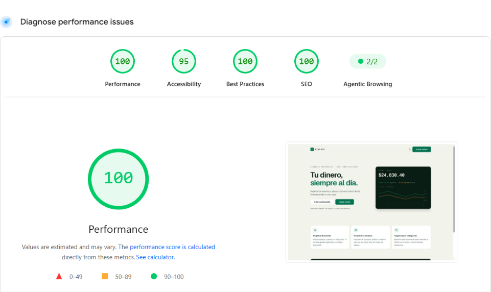

# Personal Finance Tracker

Aplicación para el registro y visualización de finanzas personales: ingresos, gastos, categorías y resúmenes gráficos. En Next.js con React 19, comunicado con una API en Fastify y base de datos en MongoDB, el Frontend está desplegado con Vercel y el backend en Railway.

---

## Contenido

- [Tecnologías](#tecnologías)
- [Arquitectura](#arquitectura)
- [Decisiones de diseño](#decisiones-de-diseño)
- [Estructura del proyecto](#estructura-del-proyecto)
- [Comandos](#comandos)
- [Variables de entorno](#variables-de-entorno)
- [Entornos](#entornos)
- [SEO](#seo)
- [Probar aplicación](#probar-aplicación)
- [Pruebas](#pruebas)

---

## Tecnologías

### Dependencias de producción

| [Next.js](https://nextjs.org) - 16.3.0
| [React](https://react.dev) - 19.2.8
| [TypeScript](https://www.typescriptlang.org) - 5.9.3
| [Tailwind CSS](https://tailwindcss.com) - 4.3.3
| [Redux Toolkit](https://redux-toolkit.js.org) - 2.12.0
| [React Redux](https://react-redux.js.org) - 9.3.0
| [TanStack React Query](https://tanstack.com/query) - 5.101.4
| [Axios](https://axios-http.com) - 1.19.0 
| [React Hook Form](https://react-hook-form.com) - 7.84.0
| [jwt-decode](https://github.com/auth0/jwt-decode) - 4.0.0

### Dependencias de desarrollo

| [Vitest](https://vitest.dev) - 4.1.10
| [@vitest/coverage-v8](https://vitest.dev) - 4.1.10 
| [Testing Library (React)](https://testing-library.com) - 16.3.2
| [@testing-library/jest-dom](https://testing-library.com) - 7.0.0
| [@testing-library/user-event](https://testing-library.com) - 14.6.3
| [MSW](https://mswjs.io) - 2.15.0
| [jsdom](https://github.com/jsdom/jsdom) - 30.0.1
| [ESLint](https://eslint.org) - 9.39.5
| [eslint-config-next](https://nextjs.org) - 16.3.0
| [pnpm](https://pnpm.io) - 11.10.0

---

## Arquitectura

La aplicación sigue un estructura de **App Router de Next.js**, separando el **estado del servidor** (React Query), y manteniendo una **capa de servicios** independiente que concentra todo el acceso HTTP de la API.

### Capas

| Capa | Ruta | Responsabilidad |
| --- | --- | --- |
| **Páginas y layouts** | `src/app` | Rutas, metadata SEO, layouts (auth, dashboard), middleware de sesión (`proxy.ts`) |
| **Componentes** | `src/components` | UI por dominio: `auth`, `dashboard`, `transactions`, `categories`, `ui` (primitivas), `common` |
| **Hooks** | `src/hooks` | Hooks de React Query divididos en `queries/` y `mutations/`, con claves centralizadas (`*.keys.ts`) |
| **Servicios** | `src/services` | Funciones `async` que envuelven a `apiClient` con tipos de respuesta fuertes |
| **Estado de UI** | `src/store` | Slices de Redux: `loader` (contador de requests en vuelo) y `theme` (claro/oscuro) |
| **Lib** | `src/lib` | Cliente HTTP, manejo de mensajes de éxito/error, sesión, utilidades de formato y redirección segura |
| **Layouts** | `src/layouts` | Cabecera y pie reutilizables de la web pública |
| **Pruebas** | `tests` | Espejo de la estructura de `src` para `lib`, `services`, `store` y `hooks` |

### Autenticación

El esquema de sesión es de **cookies con tokens rotables**:

1. **Backend** emite `refresh_token` y `access_token` como cookies `httpOnly` en su propio dominio.
2. **Frontend** replica una cookie de sesión (`auth_session`, `SameSite=Lax`, 7 días) en su dominio (`lib/auth/session-cookie.ts`). Es la señal que usa el middleware para decidir si el usuario está autenticado.
3. **Middleware (`proxy.ts`)**: en el servidor, redirige a `/login` si falta sesión en rutas protegidas, y a `/dashboard` si hay sesión en `/`, `/login` o `/register`.
4. **Interceptor de respuestas (`lib/api/client.ts`)**: cualquier respuesta `401` (excepto el propio endpoint de refresh o el login y register) dispara un refresh de tokens vía `/auth/refresh`; la pila de requests se encolan hasta que el refresh termina. Si el refresh falla, se limpia la sesión y se redirige a `/login?from=…`.
5. **Login/registro**: tras autenticarse, el cliente setea `auth_session` y redirige (el login a través de `resolvePostAuthPath`, que protege contra open redirect con `/login`, `/register`, `//` y `\`).

### Manejo de errores

El backend responde los errores con `{ code, message }`. El frontend mapea esos códigos a mensajes legibles:

- **`lib/api/error-message.ts`** → `getMutationErrorMessage(code)`: mapa `MUTATION_ERROR_MESSAGES` con fallback por defecto.
- **`lib/api/success-message.ts`** → `getMutationSuccessMessage(code)`: mensajes de éxito por código de operación.
- **`lib/api/client.ts`** → `attachBackendCode()`: normaliza el error de axios para que `catch (error)` pueda leer `error.code` con el código del backend (el interceptor copia `response.data.code` a `error.code`).

El `tsconfig.json` usa `useUnknownInCatchVariables: false` para permitir el acceso directo a `error.code` en los bloques `catch`.

### Estado global vs. servidor

- **React Query** gestiona todo el estado del servidor: cache de transacciones, categorías, perfil y parámetros. `QueryProvider` configura `retry: 1`, `refetchOnWindowFocus: false` y `staleTime: 60s`.
- **Redux** solo gestiona UI efímera y global: el **loader global** (incremento/decremento por request del interceptor) y el **tema** (persistido en `localStorage` con un script inline en `<head>` para evitar FOUC (Flash of Unstyled Content)).

### Gráfica de saldo

El `BalanceCard` dibuja la gráfica de líneas con **SVG nativo** (sin librería de charts). Soporta:

- Rangos (`6m`, `3m`, `30d`, `7d`) y filtros (`ingresos`, `gastos`, `todo`) mantenidos en la **URL** (`?range=&chart=`) vía `useChartTypeFilter`/`useChartRangeFilter`, lo que los hace compartibles y persistibles.
- Modo `mock` para la web pública (homepage y login), con animaciones CSS (`chart-draw`, `chart-flow`).

### Estilos y tema

- **Tailwind CSS v4** con tokens definidos en `@theme` (`globals.css`): `paper`, `surface`, `ink`, `ink-soft`, `line`, `leaf-*` (verde), `gold-*`.
- Los tokens **se invierten en modo oscuro** (`.dark`): `ink` pasa de oscuro a claro. Los componentes con fondos "fijos" (tarjetas oscuras tipo `bg-ink`) sobrescriben con `dark:bg-[#18221d] dark:text-ink`.
- **Diseño mobile-first**: todos los breakpoints usan variantes min-width (`sm:`, `lg:`, …); ninguna `max-*:`. Navegación inferior móvil, sidebar colapsable en escritorio y textos centrados en pantallas pequeñas.

---

## Decisiones de diseño

1. **Server Components por defecto** — Las páginas públicas (`home`, `login`, `register`) son server components con metadata SEO completa; solo los componentes interactivos se marcan `"use client"`.
2. **Capa de servicios** — `src/services` es el único lugar que importa `apiClient`.
3. **Claves tipadas de React Query** — Cada hook expone `*.keys.ts` (ej. `transactionKeys.list(filters)`) para invalidar queries de forma consistente.
4. **Errores mapeados por código** — Los mensajes de error de UI provienen de códigos del backend, nunca de strings del servidor ni de mensajes por defecto hardcodeados en cada componente.
5. **Formato de moneda determinista** — `formatCompactCurrency` en `BalanceCard` evita la diferencia entre el ICU de Node y el del navegador (hydrate mismatch).
6. **Filtros en la URL** — Los filtros de transacciones y de la gráfica viven en query params, no en estado local: compartibles, retrocedibles y limpiables.
7. **Seguridad de redirección** — `resolvePostAuthPath` valida el destino post-login contra open redirects.
8. **Tema sin parpadeo (FOUC)** — Script inline en `<head>` lee `localStorage`/`prefers-color-scheme` antes del primer render.
9. **Sin librería de gráficas** — SVG nativo: control total del diseño, cero dependencias y animaciones CSS ligeras.
10. **pnpm como gestor** — Velocidad de instalación y deduplicación estricta; la versión queda fijada en `packageManager`.

---

## Estructura del proyecto

```
├── src/
│   ├── app/                        # App Router: rutas, layouts, metadata
│   │   ├── (dashboard)/            # Grupo de rutas autenticadas
│   │   │   ├── dashboard/
│   │   │   ├── movements/
│   │   │   ├── categories/
│   │   │   └── settings/
│   │   ├── login/
│   │   ├── register/
│   │   ├── oauth-success/
│   │   ├── layout.tsx              # Layout raíz (providers + tema)
│   │   ├── page.tsx                # Homepage pública
│   │   ├── globals.css             # Tokens de tema y estilos base
│   │   ├── proxy.ts                # Middleware de sesión (redirecciones)
│   │   ├── robots.ts / sitemap.ts
│   │   └── not-found.tsx             # Página 404 para rutas inexistentes
│   ├── components/
│   │   ├── auth/                   # AuthShell, BalanceCard, formularios
│   │   ├── dashboard/              # Shell, sidebar, header, profile
│   │   ├── transactions/           # Lista, formulario, filtros, fila
│   │   ├── categories/             # Lista, grupos, modal de borrado
│   │   ├── ui/                     # Primitivas: Modal, Field, InfoModal, icons
│   │   └── common/                 # Loader
│   ├── hooks/                      # React Query por dominio
│   │   ├── auth/                   # useLogin, useRegister, useLogout, …
│   │   ├── transactions/           # useTransactions, useTransactionSummary, …
│   │   ├── categories/
│   │   ├── profile/
│   │   └── params/
│   ├── layouts/                    # header.ts, footer.ts (web pública)
│   ├── lib/
│   │   ├── api/                    # client.ts, error-message.ts, success-message.ts
│   │   ├── auth/                   # session-cookie.ts, tokens.ts
│   │   ├── providers/              # QueryProvider, StoreProvider
│   │   ├── types/                  # auth, transaction, category, params, error
│   │   └── utils/                  # format, redirect, provider, loaderEvents
│   ├── services/                   # auth.ts, transactions.ts, categories.ts, params.ts
│   └── store/                      # Redux: index.ts, loader.slice, theme.slice
├── tests/                          # Espejo de src (lib, services, store, hooks)
├── vitest.config.ts                # Config de pruebas y umbrales de cobertura
├── next.config.ts
├── tsconfig.json                   # Paths @/* y @test/*
└── package.json
```

---

## Comandos

| Comando | Descripción |
| --- | --- |
| `pnpm dev` | Servidor de desarrollo (Next.js) |
| `pnpm build` | Build de producción |
| `pnpm start` | Servidor de producción |
| `pnpm lint` | ESLint del proyecto |
| `pnpm test` | Ejecuta Vitest (una sola pasada) |
| `pnpm test:watch` | Vitest en modo watch |
| `pnpm test:coverage` | Vitest con cobertura (v8) y umbrales |

---

## Variables de entorno

| Variable | Descripción | Default |
| --- | --- | --- |
| `NEXT_PUBLIC_API_URL` | URL base de la API en Fastify | `http://localhost:4000` |
| `NEXT_PUBLIC_APP_URL` | URL pública de la app (para metadata/SEO) | `https://personal-finance-tracker-sepia-rho.vercel.app` |

Los valores de producción están en `.env.production` (usado al hacer build) y se documentan en [Entornos](#entornos).

---

## Entornos

| Entorno | URL |
| --- | --- |
| **Frontend** | Desarrollo: `http://localhost:3000` |
| | Producción: `https://personal-finance-tracker-sepia-rho.vercel.app` |
| **Backend (API)** | Desarrollo: `http://localhost:4000` |
| | Producción: `https://personalfinanceapi-production-b1ac.up.railway.app` |
| **Docs API** | Swagger: `https://personalfinanceapi-production-b1ac.up.railway.app/docs` |

---

## SEO

La aplicación incorpora prácticas de SEO para que la landing page se comparta y posicione correctamente:

- **Metadata completa** (`src/app/layout.tsx` y `src/app/page.tsx`): `title` con plantilla, `description`, `canonical`, Open Graph (título, descripción, imagen) y Twitter Cards.
- **Imagen social** en `public/landingpage.png` para el preview al compartir enlaces, resuelta contra `metadataBase` (URL absoluta de producción).
- **Archivos estáticos**: `sitemap.ts`, `robots.ts`, `favicon.ico`, `icon.svg`, `apple-icon.png` y `opengraph-image.tsx`.
- **JSON-LD** (`SoftwareApplication`) en la homepage para datos estructurados.
- **SSR**: las páginas públicas son Server Components, lo que garantiza HTML indexable sin renderizado en cliente.

### Resultado en Lighthouse



---

## Probar aplicación

Requisitos: Node.js ≥ 20 y pnpm.

### Opción 1 — Todo en local (backend + frontend)

```bash
# 1. Instalar dependencias
pnpm install

# 2. Variables de entorno (opcional, usa los defaults)
# .env.local
NEXT_PUBLIC_API_URL=http://localhost:4000
NEXT_PUBLIC_APP_URL=http://localhost:3000

# 3. Levantar el backend (repo personal-finance-tracker-api) en el puerto 4000

# 4. Iniciar el frontend
pnpm run dev
```

La app estará disponible en `http://localhost:3000`.

### Opción 2 — Frontend local con backend de producción 

Para probar el frontend sin levantar el backend localmente, apunta a la API desplegada en Railway:

```bash
# 1. Instalar dependencias
pnpm install

# 2. Variables de entorno apuntando al backend de producción
# .env.local
NEXT_PUBLIC_API_URL=https://personalfinanceapi-production-b1ac.up.railway.app
NEXT_PUBLIC_APP_URL=http://localhost:3000

# 3. Iniciar el frontend
pnpm run dev
```

### Opción 3 — Probar la app desplegada (recomendada)

Sin instalar nada: visita `https://personal-finance-tracker-sepia-rho.vercel.app` (frontend en producción conectado al backend de producción).

---

## Pruebas

Suite de **Vitest + Testing Library** con entorno `jsdom` y cobertura v8. Estructura espejada:

- `tests/lib` — utilidades puras: formato, redirección, tokens, mensajes de error, cliente HTTP.
- `tests/services` — contratos HTTP de cada servicio (URLs, payloads, headers).
- `tests/store` — slices de Redux (loader, theme).
- `tests/hooks` — hooks de React Query: llamado al servicio, invalidación de cache y propagación de errores.

Umbrales de cobertura (ver `vitest.config.ts`): 75% statements/lines/functions y 65% branches en `src/lib`, `src/services` y `src/store`.

---
